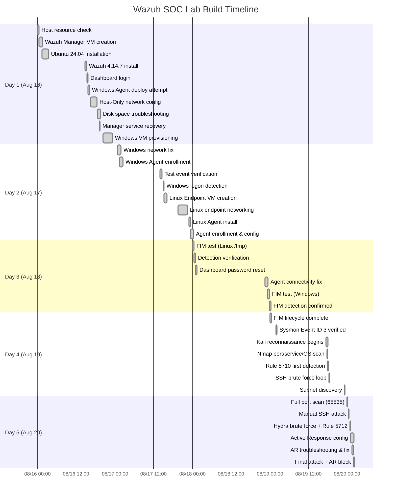

# Wazuh SOC Lab — Documentation Strategy (Updated)

> [!NOTE]
> **Last updated:** August 20, 2026 — reflects all cleanup actions completed:
> - 22 unrelated screenshots deleted (6.71 MB freed)
> - 286 screenshots renamed with descriptive functional names
> - Organized into 4 importance-tier folders

---

## Project Overview

**Title:** Design and Implementation of a Virtualized SOC Lab for SSH Attack Detection and Automated Active Response Using Wazuh

**Duration:** August 16–20, 2026 (5 days)

**Author:** Mohammed Abdulrahman

**Scope:** Built an isolated VirtualBox SOC environment with 4 VMs, simulated SSH attacks from Kali → Ubuntu, detected via Wazuh Rules 5710/5712, triggered Active Response (firewall-drop), and demonstrated Windows Sysmon endpoint telemetry + FIM.

---

## Lab Architecture

```
┌─────────────────────────────────────────────────────────┐
│                  Host-Only Network                      │
│                  192.168.56.0/24                        │
│                                                         │
│  ┌──────────────┐  ┌──────────────┐  ┌──────────────┐  │
│  │ Wazuh Manager│  │ Linux Target │  │ Windows Agent│  │
│  │ 192.168.56.2 │  │192.168.56.30 │  │192.168.56.101│  │
│  │ Ubuntu 24.04 │  │ Ubuntu 24.04 │  │ Windows 11   │  │
│  │ Wazuh 4.14.7 │  │ Agent ID 003 │  │ Agent ID 002 │  │
│  │ Ports: 443,  │  │ OpenSSH 9.6p1│  │ Sysmon 15.21 │  │
│  │ 1514, 1515,  │  │              │  │ WazuhSvc     │  │
│  │ 55000        │  │              │  │              │  │
│  └──────────────┘  └──────────────┘  └──────────────┘  │
│                          ▲                              │
│                          │ SSH Attack                   │
│                    ┌─────┴────────┐                     │
│                    │  Kali Linux  │                     │
│                    │192.168.56.102│                     │
│                    │  Nmap, Hydra │                     │
│                    └──────────────┘                     │
└─────────────────────────────────────────────────────────┘
```

---

## Current Screenshot Inventory

### Cleanup Actions Completed

| Action | Details |
|---|---|
| **Deleted** | 22 unrelated files (voter roll PDFs, job portal, blank/corrupt, portfolio notes) |
| **Space freed** | 6.71 MB |
| **Renamed** | All 286 remaining screenshots with descriptive functional names |
| **Organized** | Into 4 importance-tier folders |
| **Final count** | **286 screenshots** (was 308) |

### Folder Structure

```
screenshots/
├── 1_CRITICAL/   →   8 files   ← Report essentials
├── 2_HIGH/       →  93 files   ← Important evidence
├── 3_MEDIUM/     →  75 files   ← Supporting context
└── 4_LOW/        → 110 files   ← Troubleshooting / debug
```

### Naming Convention

Every file follows: `CATEGORY_descriptive_function_name.png`

| Prefix | Count | What It Covers |
|---|---|---|
| `RECON_` | 6 | Nmap scans, arp-scan, SSH enumeration |
| `ATTACK_` | 8 | SSH brute force, Hydra, FIM test writes |
| `DETECT_` | 39 | Wazuh rule firings, dashboard alerts, MITRE mappings |
| `AR_` | 6 | Active Response config & execution |
| `LOGGING_` | 7 | Endpoint sshd/journalctl/PAM logs |
| `SYSMON_` | 5 | Windows Sysmon Event ID 3, service status |
| `CONFIG_` | 28 | ossec.conf edits, agent config, dashboard settings |
| `SETUP_` | 50 | VM creation, Wazuh installation, agent enrollment |
| `NETCFG_` | 39 | IP configuration, netplan, VirtualBox adapters |
| `TROUBLESHOOT_` | 90 | Errors, fixes, debug (disk full, YAML, boot) |
| `OTHER_` | 8 | Host resource checks, desktop states |

---

## Tier 1 — CRITICAL Screenshots (8 files)

> [!IMPORTANT]
> These 8 screenshots are the **non-negotiable evidence** for any report, presentation, or portfolio entry. Each proves a key milestone in the attack-detection-response chain.

| # | File | Location | What It Proves |
|---|---|---|---|
| 1 | [`RECON_kali_nmap_ssh22_openssh_os.png`](file:///c:/Users/mrmda/OneDrive/Desktop/My%20Files/Projects/Cybersecurity%20Project/wazuh/screenshots/1_CRITICAL/RECON_kali_nmap_ssh22_openssh_os.png) | `1_CRITICAL/` | Nmap discovers 22/tcp open, OpenSSH 9.6p1, OS Linux 4.X\|5.X |
| 2 | [`RECON_kali_nmap_full_65535_ssh_os.png`](file:///c:/Users/mrmda/OneDrive/Desktop/My%20Files/Projects/Cybersecurity%20Project/wazuh/screenshots/1_CRITICAL/RECON_kali_nmap_full_65535_ssh_os.png) | `1_CRITICAL/` | Full 65535-port scan with OS fingerprint |
| 3 | [`ATTACK_kali_ssh_brute_force_loop_10x.png`](file:///c:/Users/mrmda/OneDrive/Desktop/My%20Files/Projects/Cybersecurity%20Project/wazuh/screenshots/1_CRITICAL/ATTACK_kali_ssh_brute_force_loop_10x.png) | `1_CRITICAL/` | `for i in {1..10}; do ssh invaliduser@192.168.56.30` |
| 4 | [`LOGGING_sshd_auth_failures_192_168_56_102.png`](file:///c:/Users/mrmda/OneDrive/Desktop/My%20Files/Projects/Cybersecurity%20Project/wazuh/screenshots/1_CRITICAL/LOGGING_sshd_auth_failures_192_168_56_102.png) | `1_CRITICAL/` | sshd logs: "Invalid user invaliduser from 192.168.56.102" |
| 5 | [`DETECT_dashboard_rule5710_srcip102_mitre.png`](file:///c:/Users/mrmda/OneDrive/Desktop/My%20Files/Projects/Cybersecurity%20Project/wazuh/screenshots/1_CRITICAL/DETECT_dashboard_rule5710_srcip102_mitre.png) | `1_CRITICAL/` | Rule 5710 alert: srcip=192.168.56.102, MITRE T1110.001 |
| 6 | [`DETECT_dashboard_rule5712_brute_force_lv10.png`](file:///c:/Users/mrmda/OneDrive/Desktop/My%20Files/Projects/Cybersecurity%20Project/wazuh/screenshots/1_CRITICAL/DETECT_dashboard_rule5712_brute_force_lv10.png) | `1_CRITICAL/` | Rule 5712 Level 10: "brute force trying to get access" |
| 7 | [`AR_config_firewall_drop_rule5710_60s.png`](file:///c:/Users/mrmda/OneDrive/Desktop/My%20Files/Projects/Cybersecurity%20Project/wazuh/screenshots/1_CRITICAL/AR_config_firewall_drop_rule5710_60s.png) | `1_CRITICAL/` | Final AR XML: firewall-drop on rule 5710, timeout 60s |
| 8 | [`AR_kali_attacker_blocked_firewall_drop.png`](file:///c:/Users/mrmda/OneDrive/Desktop/My%20Files/Projects/Cybersecurity%20Project/wazuh/screenshots/1_CRITICAL/AR_kali_attacker_blocked_firewall_drop.png) | `1_CRITICAL/` | SSH connection dropped — attacker blocked |

---

## Tier 2 — HIGH Screenshots (93 files)

These are organized by project phase. Use 1–3 per phase for a comprehensive report.

### Phase 1: Lab Infrastructure Setup

| File | What It Proves |
|---|---|
| [`SETUP_vbox_wazuh_manager_full_config_overview.png`](file:///c:/Users/mrmda/OneDrive/Desktop/My%20Files/Projects/Cybersecurity%20Project/wazuh/screenshots/2_HIGH/SETUP_vbox_wazuh_manager_full_config_overview.png) | VM specs: 8GB RAM, 4 vCPU, 60GB, Ubuntu 24.04 |
| [`SETUP_wazuh_4_14_7_install_complete_credentials.png`](file:///c:/Users/mrmda/OneDrive/Desktop/My%20Files/Projects/Cybersecurity%20Project/wazuh/screenshots/2_HIGH/SETUP_wazuh_4_14_7_install_complete_credentials.png) | Wazuh 4.14.7 all-in-one installation complete |
| [`SETUP_wazuh_dashboard_first_login_overview.png`](file:///c:/Users/mrmda/OneDrive/Desktop/My%20Files/Projects/Cybersecurity%20Project/wazuh/screenshots/2_HIGH/SETUP_wazuh_dashboard_first_login_overview.png) | First dashboard login — SOC operational |
| [`NETCFG_vbox_all_4_vms_lab_arch.png`](file:///c:/Users/mrmda/OneDrive/Desktop/My%20Files/Projects/Cybersecurity%20Project/wazuh/screenshots/2_HIGH/NETCFG_vbox_all_4_vms_lab_arch.png) | VirtualBox Manager showing all 4 VMs |

### Phase 2: Network & Agent Enrollment

| File | What It Proves |
|---|---|
| [`NETCFG_manager_dual_nic_192_168_56_2.png`](file:///c:/Users/mrmda/OneDrive/Desktop/My%20Files/Projects/Cybersecurity%20Project/wazuh/screenshots/2_HIGH/NETCFG_manager_dual_nic_192_168_56_2.png) | Manager dual-NIC: NAT + Host-Only 192.168.56.2 |
| [`NETCFG_netplan_hostonly_192_168_56_2_yaml.png`](file:///c:/Users/mrmda/OneDrive/Desktop/My%20Files/Projects/Cybersecurity%20Project/wazuh/screenshots/2_HIGH/NETCFG_netplan_hostonly_192_168_56_2_yaml.png) | Netplan YAML with static IP configuration |
| [`SETUP_linux_agent_wazuh_4_14_7_installed.png`](file:///c:/Users/mrmda/OneDrive/Desktop/My%20Files/Projects/Cybersecurity%20Project/wazuh/screenshots/2_HIGH/SETUP_linux_agent_wazuh_4_14_7_installed.png) | Linux agent installed: `WAZUH_MANAGER=192.168.56.2` |
| [`SETUP_linux_agent_running_ports_open.png`](file:///c:/Users/mrmda/OneDrive/Desktop/My%20Files/Projects/Cybersecurity%20Project/wazuh/screenshots/2_HIGH/SETUP_linux_agent_running_ports_open.png) | Agent running, ports 1514/1515 open |
| [`CONFIG_dashboard_3_agents_all_active.png`](file:///c:/Users/mrmda/OneDrive/Desktop/My%20Files/Projects/Cybersecurity%20Project/wazuh/screenshots/2_HIGH/CONFIG_dashboard_3_agents_all_active.png) | Dashboard: 3 agents all active |

### Phase 3: SSH Reconnaissance

| File | What It Proves |
|---|---|
| [`NETCFG_kali_ip_ping_target_manager.png`](file:///c:/Users/mrmda/OneDrive/Desktop/My%20Files/Projects/Cybersecurity%20Project/wazuh/screenshots/2_HIGH/NETCFG_kali_ip_ping_target_manager.png) | Kali 192.168.56.102, ping to target 0% loss |
| [`RECON_kali_nmap_ssh2_enum_algos.png`](file:///c:/Users/mrmda/OneDrive/Desktop/My%20Files/Projects/Cybersecurity%20Project/wazuh/screenshots/2_HIGH/RECON_kali_nmap_ssh2_enum_algos.png) | SSH algorithm enumeration (KEX, ciphers, MACs) |
| [`RECON_kali_subnet_arp_nmap_sweep.png`](file:///c:/Users/mrmda/OneDrive/Desktop/My%20Files/Projects/Cybersecurity%20Project/wazuh/screenshots/2_HIGH/RECON_kali_subnet_arp_nmap_sweep.png) | Full subnet ARP + Nmap host discovery |

### Phase 4: Controlled SSH Attack

| File | What It Proves |
|---|---|
| [`ATTACK_kali_manual_ssh_password.png`](file:///c:/Users/mrmda/OneDrive/Desktop/My%20Files/Projects/Cybersecurity%20Project/wazuh/screenshots/2_HIGH/ATTACK_kali_manual_ssh_password.png) | Manual SSH: `ssh invaliduser@192.168.56.30` |
| [`ATTACK_kali_hydra_ssh_brute_force.png`](file:///c:/Users/mrmda/OneDrive/Desktop/My%20Files/Projects/Cybersecurity%20Project/wazuh/screenshots/2_HIGH/ATTACK_kali_hydra_ssh_brute_force.png) | Hydra: `hydra -l invaliduser -P passwords.txt ssh://` |
| [`ATTACK_kali_pre_attack_port22_open.png`](file:///c:/Users/mrmda/OneDrive/Desktop/My%20Files/Projects/Cybersecurity%20Project/wazuh/screenshots/2_HIGH/ATTACK_kali_pre_attack_port22_open.png) | Pre-AR attack: port 22 open, connection accepted |

### Phase 5: Endpoint Logging

| File | What It Proves |
|---|---|
| [`LOGGING_journalctl_sshd_invalid_user.png`](file:///c:/Users/mrmda/OneDrive/Desktop/My%20Files/Projects/Cybersecurity%20Project/wazuh/screenshots/2_HIGH/LOGGING_journalctl_sshd_invalid_user.png) | journalctl: sshd invalid user from attacker IP |
| [`LOGGING_journalctl_failed_password_pam.png`](file:///c:/Users/mrmda/OneDrive/Desktop/My%20Files/Projects/Cybersecurity%20Project/wazuh/screenshots/2_HIGH/LOGGING_journalctl_failed_password_pam.png) | PAM failure logs after manual attack |
| [`LOGGING_journalctl_hydra_rapid_failures.png`](file:///c:/Users/mrmda/OneDrive/Desktop/My%20Files/Projects/Cybersecurity%20Project/wazuh/screenshots/2_HIGH/LOGGING_journalctl_hydra_rapid_failures.png) | Rapid-fire Hydra auth failures |

### Phase 6: Wazuh Detection

| File | What It Proves |
|---|---|
| [`DETECT_dashboard_rule5710_detail.png`](file:///c:/Users/mrmda/OneDrive/Desktop/My%20Files/Projects/Cybersecurity%20Project/wazuh/screenshots/2_HIGH/DETECT_dashboard_rule5710_detail.png) | Rule 5710 alert detail view |
| [`DETECT_dashboard_rule5710_json_mitre.png`](file:///c:/Users/mrmda/OneDrive/Desktop/My%20Files/Projects/Cybersecurity%20Project/wazuh/screenshots/2_HIGH/DETECT_dashboard_rule5710_json_mitre.png) | Rule 5710 JSON with MITRE + compliance |
| [`DETECT_dashboard_rule5710_mitre_compliance.png`](file:///c:/Users/mrmda/OneDrive/Desktop/My%20Files/Projects/Cybersecurity%20Project/wazuh/screenshots/2_HIGH/DETECT_dashboard_rule5710_mitre_compliance.png) | MITRE ATT&CK + PCI/HIPAA/NIST mappings |
| [`DETECT_dashboard_rule5710_108hits.png`](file:///c:/Users/mrmda/OneDrive/Desktop/My%20Files/Projects/Cybersecurity%20Project/wazuh/screenshots/2_HIGH/DETECT_dashboard_rule5710_108hits.png) | Threat Hunting: 108 hits on Rule 5710 |
| [`DETECT_dashboard_rule5710_147hits.png`](file:///c:/Users/mrmda/OneDrive/Desktop/My%20Files/Projects/Cybersecurity%20Project/wazuh/screenshots/2_HIGH/DETECT_dashboard_rule5710_147hits.png) | Later: 147 hits after more attacks |

### Phase 7: Active Response

| File | What It Proves |
|---|---|
| [`AR_manager_config_firewall_drop_typo.png`](file:///c:/Users/mrmda/OneDrive/Desktop/My%20Files/Projects/Cybersecurity%20Project/wazuh/screenshots/2_HIGH/AR_manager_config_firewall_drop_typo.png) | Initial config with typo (`friewall-drop`) |
| [`TROUBLESHOOT_xml_root_cause_typo_tag.png`](file:///c:/Users/mrmda/OneDrive/Desktop/My%20Files/Projects/Cybersecurity%20Project/wazuh/screenshots/2_HIGH/TROUBLESHOOT_xml_root_cause_typo_tag.png) | Root cause: unclosed XML tag identified |
| [`TROUBLESHOOT_ar_command_order_error.png`](file:///c:/Users/mrmda/OneDrive/Desktop/My%20Files/Projects/Cybersecurity%20Project/wazuh/screenshots/2_HIGH/TROUBLESHOOT_ar_command_order_error.png) | AR command/response ordering fix |

### Phase 8: Windows Sysmon

| File | What It Proves |
|---|---|
| [`SYSMON_windows_sysmon64_1608_events.png`](file:///c:/Users/mrmda/OneDrive/Desktop/My%20Files/Projects/Cybersecurity%20Project/wazuh/screenshots/2_HIGH/SYSMON_windows_sysmon64_1608_events.png) | Sysmon64 service running, 1,608 events |
| [`SYSMON_eventid3_agent_to_manager_1514.png`](file:///c:/Users/mrmda/OneDrive/Desktop/My%20Files/Projects/Cybersecurity%20Project/wazuh/screenshots/2_HIGH/SYSMON_eventid3_agent_to_manager_1514.png) | Event ID 3: agent → manager port 1514 |
| [`CONFIG_windows_sysmon_eventchannel.png`](file:///c:/Users/mrmda/OneDrive/Desktop/My%20Files/Projects/Cybersecurity%20Project/wazuh/screenshots/2_HIGH/CONFIG_windows_sysmon_eventchannel.png) | ossec.conf: Sysmon eventchannel config |

### Phase 9: FIM (File Integrity Monitoring)

| File | What It Proves |
|---|---|
| [`ATTACK_windows_fim_controlled_write.png`](file:///c:/Users/mrmda/OneDrive/Desktop/My%20Files/Projects/Cybersecurity%20Project/wazuh/screenshots/2_HIGH/ATTACK_windows_fim_controlled_write.png) | `Add-Content "WAZUH FIM CONTROLLED TEST"` |
| [`DETECT_dashboard_rule550_checksum.png`](file:///c:/Users/mrmda/OneDrive/Desktop/My%20Files/Projects/Cybersecurity%20Project/wazuh/screenshots/2_HIGH/DETECT_dashboard_rule550_checksum.png) | Rule 550: integrity checksum changed |
| [`DETECT_dashboard_fim_delete_mitre_t1070.png`](file:///c:/Users/mrmda/OneDrive/Desktop/My%20Files/Projects/Cybersecurity%20Project/wazuh/screenshots/2_HIGH/DETECT_dashboard_fim_delete_mitre_t1070.png) | FIM deletion: MITRE T1070.004, T1485 |
| [`DETECT_dashboard_fim_lifecycle_4hits.png`](file:///c:/Users/mrmda/OneDrive/Desktop/My%20Files/Projects/Cybersecurity%20Project/wazuh/screenshots/2_HIGH/DETECT_dashboard_fim_lifecycle_4hits.png) | Complete FIM lifecycle (create → modify → delete) |

---

## Tier 3 — MEDIUM Screenshots (75 files)

Supporting context screenshots. Browse by prefix in `3_MEDIUM/`:

| Prefix | Files | Use For |
|---|---|---|
| `SETUP_` | 15 | VM provisioning steps, installer details |
| `NETCFG_` | 14 | Network config steps, ping tests |
| `CONFIG_` | 12 | ossec.conf edits, service restarts |
| `DETECT_` | 6 | Additional alert views, SCA benchmarks |
| `TROUBLESHOOT_` | 12 | Key troubleshooting (disk full, port fail) |
| `AR_` | 4 | AR log tail, builtin commands |
| `ATTACK_` | 1 | Password wordlist creation |
| `LOGGING_` | 2 | journalctl grep, SSH failure |
| `RECON_` | 1 | Port 1-1000 scan |
| `SYSMON_` | 1 | Rule 60602 windows event |

---

## Tier 4 — LOW Screenshots (110 files)

Troubleshooting and debug screenshots. **Do not include in final reports** — summarize as text instead.

Major groups in `4_LOW/`:
- **Windows boot failures** (~12): `TROUBLESHOOT_windows_winload_*`, TPM, SecureBoot, OOBE
- **Disk space exhaustion** (~15): `TROUBLESHOOT_disk_*`, `TROUBLESHOOT_sst_*`, `TROUBLESHOOT_purge_*`
- **Netplan YAML errors** (~8): `TROUBLESHOOT_netplan_*`
- **DNS resolution** (~6): `TROUBLESHOOT_dns_*`, `TROUBLESHOOT_resolv*`
- **Password resets** (~4): `TROUBLESHOOT_password_*`
- **Ubuntu installer** (~8): `SETUP_ubuntu_installer_*`, `SETUP_grub_*`

---

## Detection Rules Demonstrated

| Rule ID | Level | Description | Evidence File |
|---|---|---|---|
| **5710** | 5 | `sshd: Attempt to login using a non-existent user` | `1_CRITICAL/DETECT_dashboard_rule5710_srcip102_mitre.png` |
| **5712** | 10 | `sshd: brute force trying to get access to the system` | `1_CRITICAL/DETECT_dashboard_rule5712_brute_force_lv10.png` |
| **550** | 7 | `Integrity checksum changed` (FIM modification) | `2_HIGH/DETECT_dashboard_rule550_checksum.png` |
| **553** | 7 | `File deleted` (FIM deletion) | `2_HIGH/DETECT_dashboard_fim_delete_mitre_t1070.png` |
| **554** | 5 | `File added to the system` (FIM creation) | `2_HIGH/DETECT_dashboard_fim_rules_550_553_554.png` |
| **5402** | 3 | `Successful sudo to ROOT executed` | `2_HIGH/DETECT_manager_sudo_rule5402_compliance.png` |
| **60122** | 5 | `Logon Failure - Unknown user or bad password` (Windows) | `2_HIGH/DETECT_dashboard_failed_logon_4625_rule60122.png` |

---

## MITRE ATT&CK Mappings

| Technique | ID | Tactic | Evidence |
|---|---|---|---|
| Password Guessing | T1110.001 | Credential Access | Rule 5710 + 5712 |
| Remote Services: SSH | T1021.004 | Lateral Movement | SSH attack from Kali |
| Sudo and Sudo Caching | T1548.003 | Privilege Escalation | Rule 5402 |
| File Deletion | T1070.004 | Defense Evasion | FIM Rule 553 |
| Data Destruction | T1485 | Impact | FIM Rule 553 |

---

## Compliance Framework Mappings

| Framework | Controls | Evidence |
|---|---|---|
| **PCI DSS** | 10.2.4, 10.2.5, 10.6.1, 11.5 | Rules 5710, 550 |
| **HIPAA** | 164.312.b, 164.312.c.1 | Auth monitoring, FIM |
| **NIST 800-53** | AU.6, AU.14, AC.7, SI.7 | Audit log review, integrity |
| **GDPR** | IV_32.2, IV_35.7.d, II_5.1.f | Security event processing |
| **TSC** | CC6.1, CC6.8, CC7.2, CC7.3 | Access control, monitoring |

---

## Results Summary

| Capability | Status | Evidence Location |
|---|---|---|
| Kali → Linux connectivity | ✅ Confirmed | `2_HIGH/NETCFG_kali_ip_ping_target_manager.png` |
| SSH service discovery (22/tcp) | ✅ Confirmed | `1_CRITICAL/RECON_kali_nmap_ssh22_openssh_os.png` |
| Controlled SSH auth failure | ✅ Confirmed | `1_CRITICAL/ATTACK_kali_ssh_brute_force_loop_10x.png` |
| Linux sshd logging | ✅ Confirmed | `1_CRITICAL/LOGGING_sshd_auth_failures_192_168_56_102.png` |
| Wazuh event collection | ✅ Confirmed | `2_HIGH/CONFIG_dashboard_3_agents_all_active.png` |
| **Rule 5710 detection** | ✅ **Confirmed** | `1_CRITICAL/DETECT_dashboard_rule5710_srcip102_mitre.png` |
| **Rule 5712 brute force** | ✅ **Confirmed** | `1_CRITICAL/DETECT_dashboard_rule5712_brute_force_lv10.png` |
| Attacker source attribution | ✅ Confirmed | srcip: `192.168.56.102` in Rule 5710 |
| **Active Response invocation** | ✅ **Confirmed** | `1_CRITICAL/AR_config_firewall_drop_rule5710_60s.png` |
| **Attacker blocked** | ✅ **Confirmed** | `1_CRITICAL/AR_kali_attacker_blocked_firewall_drop.png` |
| Firewall rule verification | ⚠️ Not verified | Documented as limitation |
| Windows Sysmon telemetry | ✅ Confirmed | `2_HIGH/SYSMON_eventid3_agent_to_manager_1514.png` |
| FIM detection (Windows) | ✅ Confirmed | `2_HIGH/DETECT_dashboard_fim_lifecycle_4hits.png` |
| Windows failed logon (4625) | ✅ Confirmed | `2_HIGH/DETECT_dashboard_failed_logon_4625_rule60122.png` |

---

## Chronological Project Timeline



---

## Known Limitations

> [!WARNING]
> **Firewall verification gap:** Actual iptables/nftables rule insertion by `firewall-drop` was not independently verified via `iptables -L` or `nft list ruleset`. The report must not claim the attacker IP was blocked at the network layer. The defensible finding is that Wazuh detected the SSH attack and invoked the configured Active Response mechanism, with execution recorded in the Active Response log and the attacker's SSH connection being dropped.

---

## Documentation Output Recommendations

### For GitHub README
- Use all 8 CRITICAL screenshots as embedded images
- Add 1–2 HIGH screenshots per phase (total ~20)
- Include architecture diagram, detection rules table, MITRE mappings
- Reference files by their new descriptive names

### For LinkedIn Post
> Built an isolated VirtualBox SOC lab using Kali Linux, Ubuntu, Windows, Wazuh and Sysmon. Simulated a controlled SSH authentication attack, observed endpoint sshd telemetry, detected the activity through Wazuh Rule 5710, and triggered Wazuh Active Response. The exercise provided hands-on experience with endpoint telemetry, SIEM detection, source attribution and automated response.

### For Formal Report
- Structure around the 9 phases
- 1 CRITICAL screenshot per phase as primary visual
- 1–2 HIGH screenshots in appendix per phase
- Summarize troubleshooting as text (reference `4_LOW/` for evidence if challenged)
- Include MITRE ATT&CK + compliance tables

### For Portfolio / CV
Highlight 5 key achievements:
1. **Multi-agent SIEM deployment** — 3 endpoints → centralized Wazuh
2. **SSH attack detection chain** — Recon → Attack → Detection → Response
3. **Automated threat response** — firewall-drop on Rule 5710
4. **Compliance mapping** — MITRE ATT&CK, PCI DSS, HIPAA, NIST
5. **Cross-platform monitoring** — Linux sshd + Windows Sysmon/EventChannel

---

## Deleted Files Log

22 files removed on Aug 20, 2026 (6.71 MB freed):

| Type | Files Deleted | Reason |
|---|---|---|
| Blank/corrupt (<500 bytes) | 6 | Empty captures (123–294 bytes) |
| Voter enrollment PDFs | 11 | Personal content, not project-related |
| Job portal | 1 | Almarai career portal screenshot |
| Portfolio/roadmap notes | 4 | Planning documents, not lab evidence |
